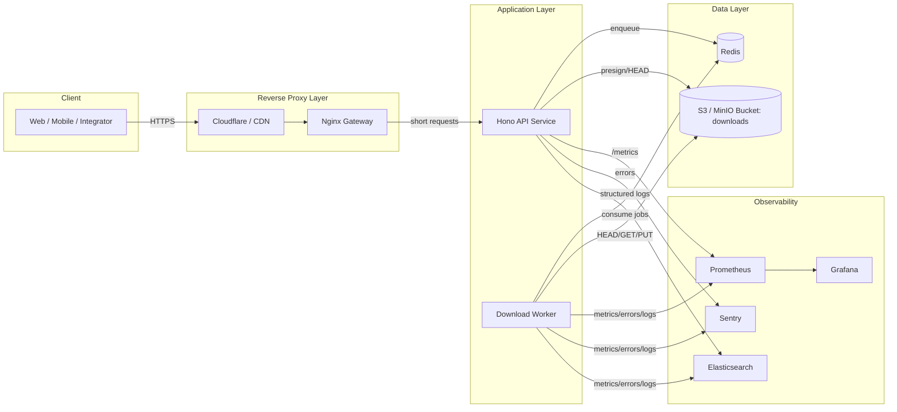

# Architecture: Long-Running Downloads (10–120s) Behind Proxies

## 1) Problem & Constraints

This service simulates downloads that can take **10–120 seconds** of server-side processing. In real deployments, requests traverse reverse proxies (Cloudflare, nginx, ALB) with hard timeouts (commonly **60–100s**). Holding a single HTTP request open until completion causes:

- **504 / timeout errors** even though work continues server-side
- **Poor UX** (no progress, unclear status)
- **Resource waste** (connections, memory, worker slots)
- **Retry storms** (clients retry the same work)

### Non-negotiable requirements

- IDs range: **10,000 → 100,000,000**
- Handle bulk jobs (up to ~1000 IDs per request today)
- Support **asynchronous** processing
- Provide **status visibility** and **retries**
- Produce a **download artifact** in S3-compatible storage (MinIO/S3)
- Observability: metrics, logs, error tracking (already present in this repo)

---

## 2) Chosen Approach: Hybrid (Polling + Optional SSE) with Background Jobs

### Why this approach

- **Polling** is universally supported, simple to deploy behind strict proxies, and works on any client.
- **SSE (Server-Sent Events)** is a low-complexity “push” enhancement for near-real-time progress without WebSocket state machines.
- Both avoid long-held “work” requests: the API returns quickly and the work runs in background.

### High-level flow

1. Client calls **initiate** endpoint → returns `jobId` immediately.
2. Worker processes IDs asynchronously, writing results and progress.
3. Client either:
   - polls `GET /v1/download/jobs/:jobId` (baseline), or
   - subscribes to `GET /v1/download/jobs/:jobId/events` (SSE) for live progress.
4. When an item is ready, the API returns a **presigned S3 URL** (or redirects to it).

---

## 3) Architecture Diagram



---

## 4) Components & Responsibilities

### 4.1 API Service (Hono)

Responsibilities:

- Validate requests (`zod`)
- Create `jobId`, accept `file_ids`, enforce size limits
- Enqueue background work (BullMQ)
- Expose job state endpoints (polling + SSE)
- Generate **presigned download URLs** (or return download metadata)
- Enforce auth/rate limits (current project has rate limiting already)

### 4.2 Worker Service

Responsibilities:

- Pull queue jobs from Redis
- For each file ID:
  - simulate processing delay (or real compute)
  - check S3 availability
  - generate / store artifact metadata
- Update job/item progress frequently
- Apply retries with backoff for transient failures

> Deployment note: the worker should be a separate process/container so it can scale independently of the API.

### 4.3 Redis (Queue + Short-Term State)

- BullMQ queues (`download:job`, `download:item`)
- Idempotency locks (`idempotency:{key}`)
- Job status cache (`job:{jobId}`)
- PubSub (optional) for SSE fan-out

### 4.4 S3 / MinIO

- Stores downloadable artifacts
- Provides presigned URLs so clients can download directly (offloading API bandwidth)

---

## 5) API Contract (Proposed)

This keeps existing endpoints for the hackathon demo, but introduces a production-ready async contract.

### 5.1 Create a job (returns immediately)

`POST /v1/download/jobs`

Request:

```json
{
  "file_ids": [70000, 70001, 70002],
  "client_reference": "optional-string",
  "callback_url": "https://example.com/webhooks/download"
}
```

Notes:

- `callback_url` is optional; enables webhook notifications (hybrid pattern).
- Support `Idempotency-Key` header to dedupe client retries.

Response (200):

```json
{
  "jobId": "uuid",
  "status": "queued",
  "total": 3,
  "createdAt": "2025-12-16T12:00:00.000Z",
  "links": {
    "self": "/v1/download/jobs/uuid",
    "events": "/v1/download/jobs/uuid/events"
  }
}
```

### 5.2 Get job status (polling)

`GET /v1/download/jobs/:jobId`

Response:

```json
{
  "jobId": "uuid",
  "status": "processing",
  "progress": { "done": 1, "failed": 0, "total": 3 },
  "startedAt": "2025-12-16T12:00:05.000Z",
  "updatedAt": "2025-12-16T12:00:27.000Z",
  "items": [
    {
      "file_id": 70000,
      "status": "completed",
      "size": 12345,
      "downloadUrl": "https://..."
    },
    { "file_id": 70001, "status": "processing" },
    { "file_id": 70002, "status": "queued" }
  ]
}
```

### 5.3 Stream live updates (optional SSE)

`GET /v1/download/jobs/:jobId/events`

- `Content-Type: text/event-stream`
- Events examples:
  - `job.started`
  - `item.started`
  - `item.completed`
  - `item.failed`
  - `job.completed`

Event payload example:

```text
event: item.completed
id: 12
data: {"file_id":70000,"status":"completed","downloadUrl":"https://...","size":12345}

```

### 5.4 Download endpoint (optional convenience)

`GET /v1/download/jobs/:jobId/items/:fileId/download`

Options:

- **302 redirect** to presigned S3 URL (preferred for browsers)
- Or return `{ downloadUrl }` for clients that want to manage redirects

### 5.5 Cancel a job

`POST /v1/download/jobs/:jobId/cancel`

Response:

```json
{ "jobId": "uuid", "status": "canceled" }
```

---

## 6) Data Model

### 6.1 Job status

`queued | processing | completed | failed | canceled | expired`

### 6.2 Suggested storage strategy

**Phase 1 (fastest to ship): Redis-only**

- Store job summary and item states in Redis hashes/JSON with TTL.
- Good enough for hackathon and early demos.

**Phase 2 (production): Postgres + Redis**

- Redis: queue + fast status cache
- Postgres: durable history (auditing, user history, analytics)

### 6.3 Example schemas (conceptual)

**download_jobs**

- `job_id (uuid, pk)`
- `status`
- `total_count`
- `done_count`
- `failed_count`
- `created_at`, `started_at`, `completed_at`
- `request_id` (to correlate with logs/metrics)
- `client_reference` (optional)

**download_job_items**

- `job_id`
- `file_id`
- `status`
- `s3_key` (nullable)
- `size_bytes` (nullable)
- `error_code` / `error_message` (nullable)
- `attempt` (int)

---

## 7) Background Processing & Reliability

### 7.1 Queue choice

Use **BullMQ + Redis**:

- Mature Node ecosystem
- Retries and backoff are built-in
- Concurrency controls are straightforward

### 7.2 Idempotency

Clients will retry when networks are flaky.

- Accept `Idempotency-Key` on `POST /v1/download/jobs`
- Cache `{ key -> jobId }` for a TTL (e.g., 24h)
- If the same key is received again, return the existing `jobId`

### 7.3 Retry policy

Classify failures:

- **Transient** (retry): timeouts, S3 5xx, connection resets
- **Permanent** (no retry): invalid `file_id`, 404/NotFound (if that’s considered permanent), validation errors

Suggested policy:

- Max attempts: 3–5
- Backoff: exponential with jitter (e.g., 2s, 10s, 30s)
- Dead-letter queue for items that exceed retries

### 7.4 Cancellation semantics

- Mark job as `canceled`
- Worker checks cancellation token between items
- If an item is already running, let it finish (or implement cooperative cancellation)

---

## 8) Proxy / Timeout Configuration

### Key principle

**Never** run the “real work” in a request that must survive proxy timeouts.

- Initiate endpoint should return in < 500ms.
- Status endpoints should return in < 200ms.
- Download should be direct-from-S3 via presigned URL.

### nginx (gateway) guidance

Already present in this repo: long proxy timeouts and `proxy_buffering off`.

For SSE specifically:

- `proxy_buffering off;` (required)
- `proxy_read_timeout` large (e.g., 1h)
- Ensure HTTP/1.1 and keep-alive

### Cloudflare guidance

- Standard HTTP requests may hit ~100s limits.
- Use:
  - short-lived REST calls (init/status)
  - SSE or WebSockets only for progress (optional)
- If SSE is unreliable under a given plan, fall back to polling.

---

## 9) Frontend Integration (React/Next.js)

### Baseline: polling

1. `POST /v1/download/jobs` → `jobId`
2. Poll `GET /v1/download/jobs/:jobId`:
   - interval: 1–2s while `processing`
   - backoff: 2s → 5s → 10s after N polls
3. Render per-file states and a final summary
4. When `downloadUrl` exists, show a “Download” button (direct link)

### Enhancement: SSE

- Open `EventSource(/v1/download/jobs/:jobId/events)`
- Update UI on events
- Still keep polling as fallback if SSE disconnects

### UX edge cases

- Browser refresh: store `jobId` in URL or localStorage and resume
- Multiple parallel jobs: list jobs in UI and show latest progress
- Partial success: allow downloading completed items while others continue

---

## 10) Observability & Correlation

### Request correlation

- Continue using `X-Request-ID` on every request.
- Include `jobId` in logs/metrics labels where safe.

### Suggested metrics additions

- `download_jobs_total{status=...}`
- `download_job_duration_seconds` (histogram)
- `download_queue_depth` (gauge)
- `download_items_total{status=...}`
- `s3_operation_duration_seconds` (histogram)

### Errors

- Capture worker exceptions in Sentry with tags:
  - `jobId`, `fileId`, `attempt`, `requestId`

---

## 11) Implementation Phases (Practical Roadmap)

### Phase A (minimal viable, best for hackathon)

- Add Redis + BullMQ
- Add worker process
- Implement `POST /v1/download/jobs` + `GET /v1/download/jobs/:jobId`
- Keep existing `/v1/download/start` as a demo endpoint only

### Phase B (UX + scaling)

- Add SSE endpoint
- Add item pagination if job sizes grow
- Add idempotency keys

### Phase C (production hardening)

- Durable DB (Postgres)
- AuthN/AuthZ
- Webhooks (optional)
- Per-user quotas and concurrency limits

---

## 12) Backwards Compatibility with Current Endpoints

This repo currently includes:

- `POST /v1/download/initiate` (returns a `jobId` but does not persist work)
- `POST /v1/download/start` (long-running)

Recommended:

- Keep them for the hackathon demo, but treat them as legacy.
- Introduce the async job endpoints above as the “real” integration path.
